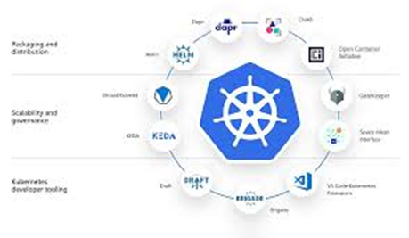
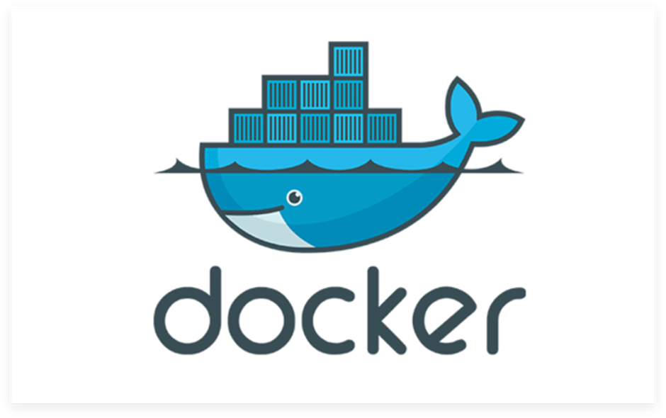
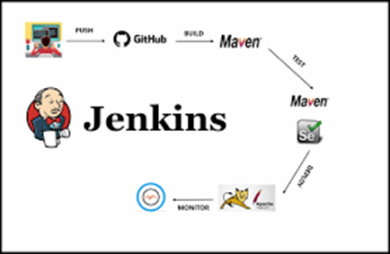
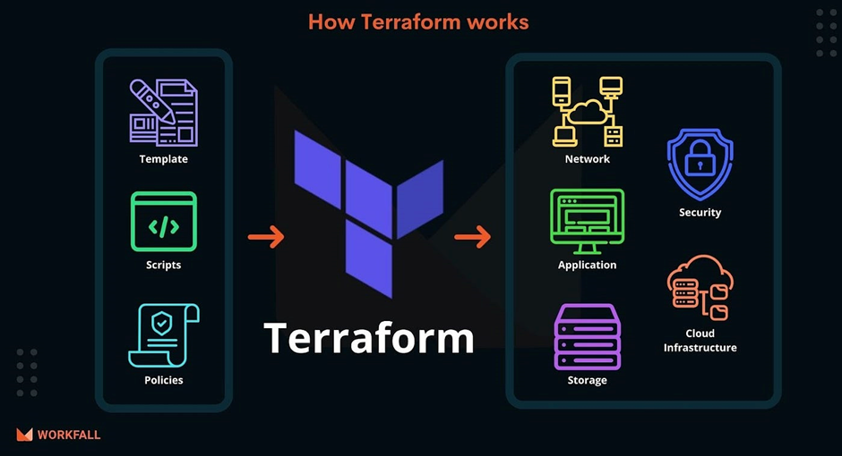

Devops Tolls in Emerging Technology.
1)  Kubernetes

 
2) Docker

 

3¬) Jenkins for Continuous Integration and Continuous Delivery

 

4)Terraform as Infrastructure as Code for multi cloud Infrastructure

 

