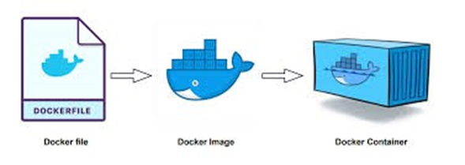
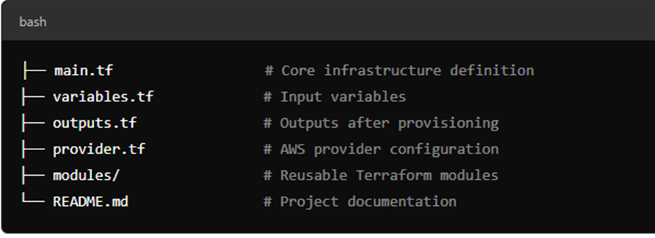

# github-kubernetes-apps
This repo is having large number of example for deploying apps in manifests format and Helm formats and other popular formats

Introduction
        This Terraform project automates the infrastructure provisioning of AWS Cloud resources or services like ,  VPCs,Subnets,Route Tables, Internet Gateways, EC2(Compute), Security Groups, ALB( Application Load Balancers), Target Groups, S3 Buckets.
Project Architecture

 

Project Structure 

 

Prerequisites

•	Terraform  v1.5.23
•	AWS CLI Configured with access_key and secret_key 
•	AWS Account with necessary Permissions 
Installation of Terraform
     Here im using a linux basd (Redhat or centos) machine for installing terraform on it.  Below is the shell script for installing the Terraform on Linux Machine( this script only works for the Redhat or Centos distributions not for any debian or ubuntu machines}
#!/bin/bash
sudo yum -y install yum-utils
sudo yum-config-manager --add-repo https://rpm.releases.hashicorp.com/RHEL/hashicorp.repo
sudo yum -y update && sudo yum install -y terraform
terraform –v  

Usage
          Initialize terraform with the   $terrafrom init Command, then provider details and backend and authentication mechanism will be initiated.
Then run  $terraform plan  command to list the resources which we are provisioning and with the parameters we have given.
Then finally if want to provision resources on AWS Cloud then run the commad 
 $terraform apply
 Variables Used
       Variables are  used to store the values for certain attributes or values of resources like  ami id and instance type and cidr_block and etc. Variables are even used to store the access_key and secret_key for the provider details for authentication and authorization. Variables allows us not to depend upon hard coded values.
Here below parameters we have used 

•	AMI ID  
•	INSTANCE TYPE  
•	ACCESS_KEY 
•	SECRET_KEY 
•	CIDR_BLOCK  

Output
        For this project we are declaring the output value of load balancer dns name.

output "loadbalancerdns" {
  value = aws_lb.myalb.dns_name
}

 

 

